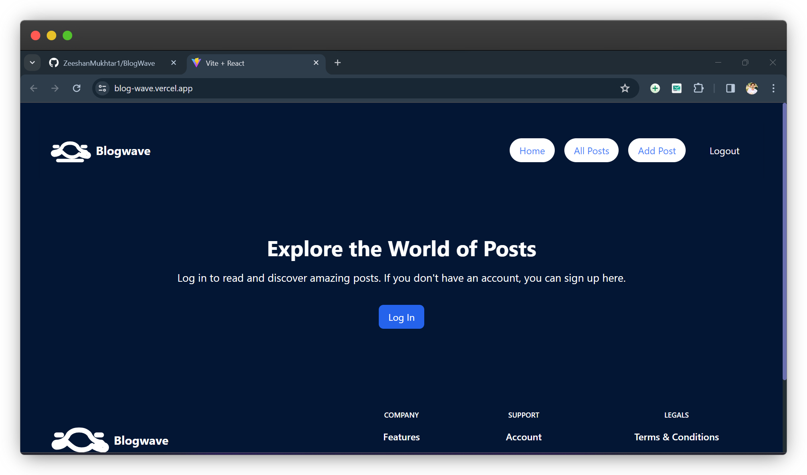
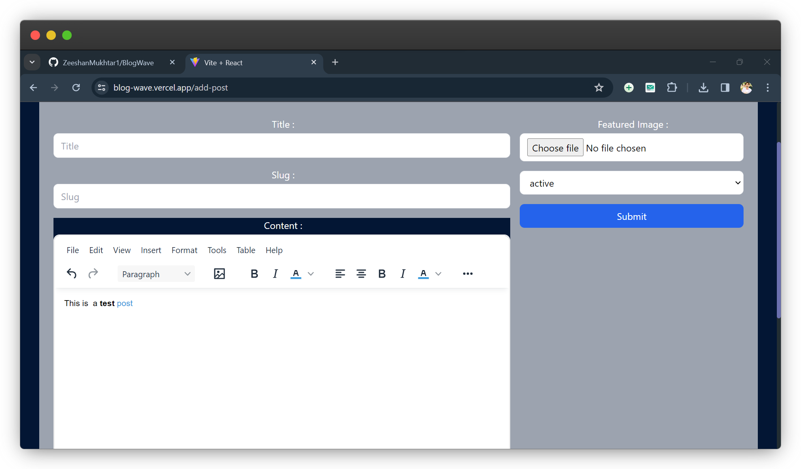
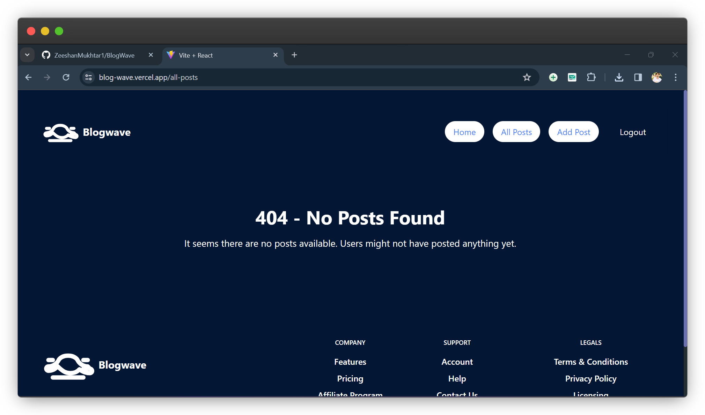
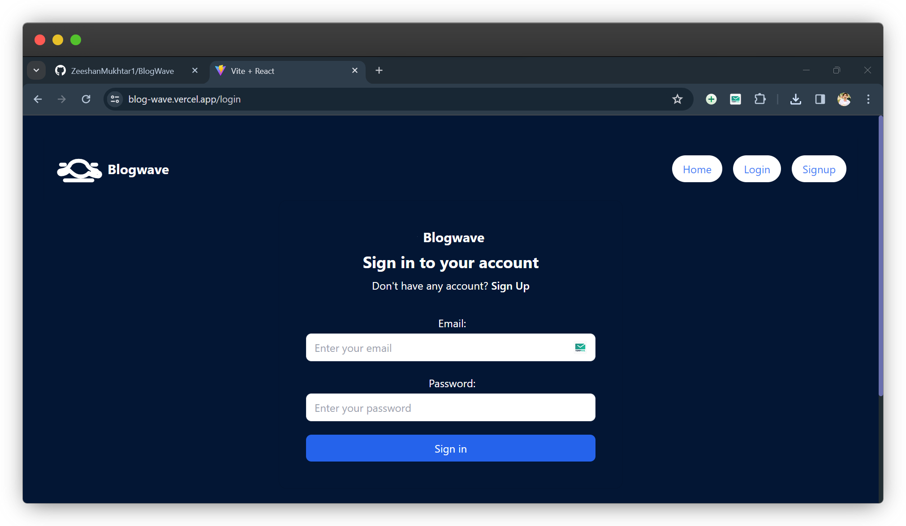

# BlogWave App

BlogWave is a simple blogging platform developed using React and Appwrite. It provides basic CRUD functionality, a real-time rich-text editor (RTE), and a clean user interface for managing and creating blog posts.

## Introduction

BlogWave is designed to be a minimalistic and easy-to-use blogging platform. It leverages React for building the user interface and Appwrite as the backend service, ensuring a smooth and responsive user experience.

## Technologies Used

- React: A popular JavaScript library for building user interfaces.
- Appwrite: An open-source backend server that helps developers build applications faster.
- Tailwind CSS: A utility-first CSS framework for rapidly building custom user interfaces.

- React-Hook-Form: A library for building forms in React.

## Features

- Create, Read, Update, and Delete (CRUD) functionality for blog posts.
- Real-time rich-text editor for an enhanced writing experience.
- Clean and intuitive user interface.

## Usage

1. Clone the repository:

   ```bash
   git clone https://github.com/ZeeshanMukhtar1/BlogWave.git
   ```

2. Install dependencies:

   ```bash
   npm install
   ```

3. Get your Appwrite API keys from the Appwrite dashboard.
   The sample file for the Environment Variables is provided in the repository. Rename the file to `.env.sample` and add your API keys.

4. Run the app:

   ```bash
   npm run dev
   ```

5. Open your browser and navigate to [http://localhost:5173](http://localhost:5173).

## Screenshots






## Acknowledgements

This project was created with the help of a YouTube tutorial by the [Free Code Camp](https://www.youtube.com/channel/UC8butISFwT-Wl7EV0hUK0BQ) YouTube channel.
